LibreClinica 1.0 for Monitors
=============================

[https://libreclinica.org](https://libreclinica.org) © 2020

**Preface**

This manual describes the main activities of the Monitor-role in LibreClinica 1.0: Source Data Verification and Discrepancy handling.

To use this manual an account with the role of Monitor is the only requirement.

Please contact us for manuals for the roles of Clinical Reasearch Coordinator and Investigator or if you would like a tailor-made manual, based on this one.

[The LibreClinica Community](https://libreclinica.org)

The manual is a distributed under the <a name="firstheading">Creative Commons Attribution-ShareAlike 3.0 Unported License . This means you are free to copy, distribute and transmit the work, and to adapt the work under the following conditions:</a>

1 you must attribute the work in the manner specified by the author (but not in any way that suggests that they endorse you or your use of the work.); please contact us for details

2 if you alter, transform, or build upon this work, you may distribute the resulting work only under the same, similar or a compatible license.

# Contents
  
1. [Choosing your browser and starting](#choosing-your-browser-and-starting)

1. [Logging in](#logging-in)

1. [Changing your password on first time log-in](#changing-your-password-on-first-time-log-in)

1. [Logging out](#logging-out)

1. [Changing your password](#changing-your-password)

1. [When you've lost your password](#when-youve-lost-your-password)

1. [Change Study/Site](#change-studysite)
1. [Your "Home" in OpenClinica](#your-home-in-openclinica)

1. [How data is organised in OpenClinica](#how-data-is-organised-in-openclinica)

1. [Source Data Verification](#source-data-verification)

1. [Elements of a CRF](#elements-of-a-crf)

1. [Notes & Discrepancies](#notes--discrepancies)

1. [An example of a Query](#an-example-of-a-query)

1. [An example of a Failed Validation Check](#an-example-of-a-failed-validation-check)

1. [An example of an Annotation](#an-example-of-an-annotation)

1. [An example of a Reason for Change](#an-example-of-a-reason-for-change)

1. [Study Audit Log](#study-audit-log)  

# Choosing your browser and starting

To use OpenClinica you need a browser. You can use Firefox (Mozilla) version 3 or higher, or Microsoft Internet Explorer version 7 or higher, or Chrome (Google) or Safari (Mac).

Furthermore your browser must be set up to execute Java-script.

In Firefox you can check this by clicking the menu-option "Tools"-"Options". In the window that opens, click on the tab "Content" and make sure "Enable JavaScript" is checked.
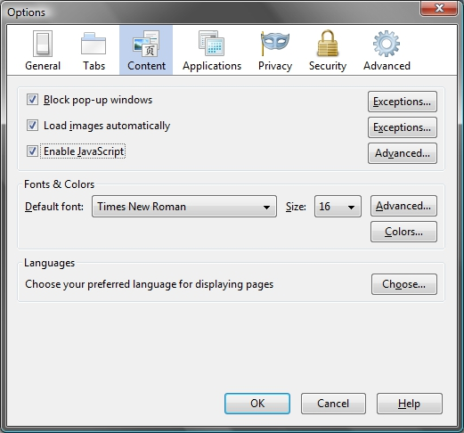

In Internet Explorer you can check if Java-script is enabled by clicking menu option "Tools", "Internet options". In the window that opens click on tab "Security". Then you click "Custom Level ..." Scroll down to "Scripting" and check if "Active Scripting" is set to "Enable".       

# Logging in

To start LibreClinica, type in the address you've been given, e. g. [https://libreclinica.org/lc-demo/](https://libreclinica.org/lc-deb10/pages/login/login). You will automatically be routed to the login-screen.
You can log in with the user name and password that have been sent to you by mail. Click on button Login.
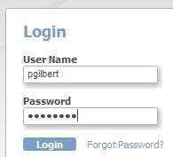

# Changing your password on first time log-in

Because this is the first time you log in to OpenClinica, you will be asked to change your password. In the form that opens, "Reset password", you are asked to once more type in the password you've been given, Old Password. In the next input you type your new password, directly followed by the same password, New Password and Confirm New Password.
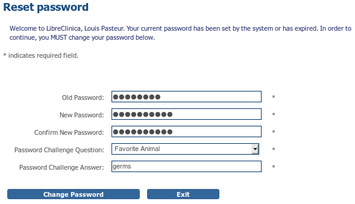

After that you must choose a question plus the answer to that question. These will be used in case you have lost your password and have to request a new one. For example: Password Challenge Question you  choose Favorite Color, with Password Challenge Answer blue.

# Logging out

When you're finished with your OpenClinica-activities you must log out. This prevents unauthorized persons to view or change the data. You log out by clicking Log Out in the upper right corner of the screen.

# Changing your password
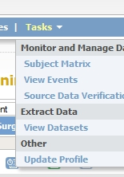

You can change your password any time by clicking menu option Tasks and then choosing Update Profile.
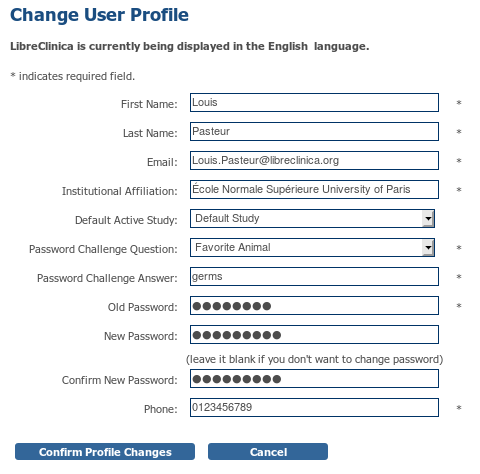

The form "Change User Profile" appears, allowing you to change data about your account. All fields with an asterisk * are required. This means you must provide a telephone number for Phone. Of course this can be any number. To save the changes you must provide your password, even if you have only changed for example your telephone number. In that case you can leave field New Password blank.

After clicking button Confirm Profile Changes, the screen "Confirm User Profile Updates" opens. Check your account-data one more time and click button Update Profile. In the left column of the screen the message "Your profile has been updated successfully" appears.

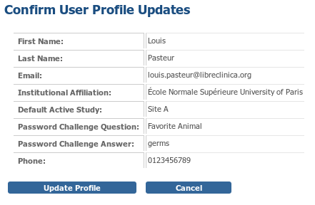

# When you've lost your password

When you've lost your password you can request a reset of the password. A new, random password will be sent to the email-address you provided in your account-data. You request this new password by clicking Forgot Password? in the log in screen. The form "Request Password Form" opens.

Type in User Name your user-name and in Email the email address, as used in OpenClinica. Then you select the Password Challenge Question and give your Password Challenge Answer. Click button Submit Password Request and after a few minutes a mail will be sent to you with the new password. After logging in with this new password, you must change it immediately, just as when you log in for the first time.

# Change Study/Site

When you log in to LibreClinica, your active study will be the study you last worked on. If you are assigned to more than one study, you can change to another study, by using the link Change Study/Site.

You see in the upper-left corner the active Study "GCP-Service training study: Bremen (TDS0004: Site B)". If you want to change to site"Amsterdam" you click the radio-button and then click the button Change Study. The screen "Confirm Changing Study" opens and here you click on Confirm.

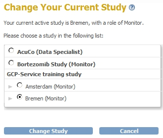

In the left column you see under Alerts & Messages "Your current active study has been changed succesfully".

Another option is when you have rights to a Study as a whole, so to all the sites. If you click the link "Change Study/Site" you can choose the Bortezomib-study and this will give you access to all sites in that study.

# Your “Home” in OpenClinica
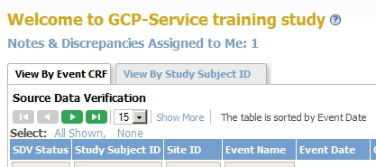

After you've logged in successfully your "Home"-screen opens. This screen displays the matrix for Source Data Validation, plus a link labeled Notes & Discrepancies Assigned to Me. You can always return to this screen by clicking Home in the menu in the top of screen. .

Your main activities in OpenClinica will be Source Data Verification, or SDV, and Discrepancy Management. You can also view all data entered by using the Subject Matrix.

As a Monitor it is not possible for you to enter Study-data, only to review data and handle queries about it.

In OpenClinica the participants of a Study are called Subjects or StudySubjects. The Subjects are assigned to Sites.

# How data is organised in OpenClinica

The visits that the Subjects make in the process of the Study are called Events.

In each Event data is collected in one or more CRFs.

Each CRF can have one or more tabs, or Sections, with input boxes for items.

# Source Data Verification

Source Data Verification is the process of comparing a source data with the data entered in OpenClinica. In the study-setup, the study-coordinator can give each CRF in each Event an "SDV-required-status". This status ranges from "not required", via "partially required" to "100% required".

When you have checked that everything has been entered in OpenClinica according to the source data, then the CRF must be marked as "SDV'd".

For items where the source data and the data in OpenClinica are different, you can create a Query, as described in [13](#--refheading--932-355433200) [An example of a Query](#--refheading--932-355433200).

Start SDV by clicking the menu-option SDV in the menu in the top of your screen. You can also click menu Tasks, Monitor and Manage Data – Source Data Verification.

The screen opens by default with the "View By Event CRF"-tab. This screen provides you several ways to quickly find the CRFs of the Subjects you want to do SDV for. It displays for all Subjects all the CRFs with status "Completed" or "Locked". The sort-order is by Event Date.

You can filter the CRF by using the columns that have an input box below the column-header. For example if you want to filter on Study Subject ID you enter this in the inputbox and hit return, or click on "Apply Filter, in the upper right corner of the matrix. Now all CRFs for for this particular Subject will be displayed.
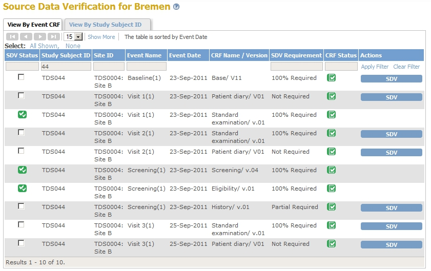

You can refine your search by displaying only the CRFs that are not SDV'd yet. To do this click in the box under the header of column "SDV Status" and choose "None".
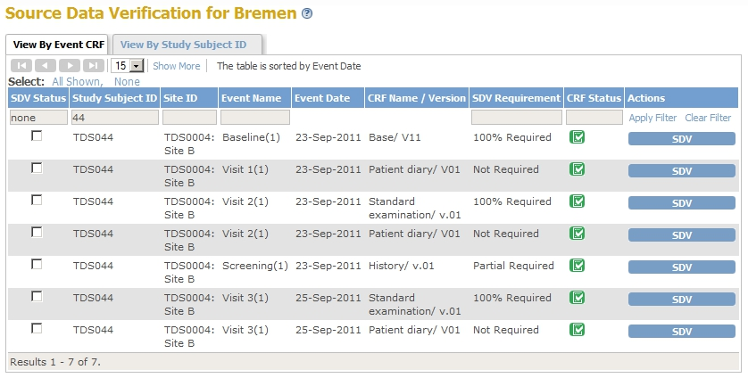

When SDV is not required for all CRFs, you can refine your search even further by filtering on "SDV Requirement". By choosing "100% Required and Partial Required" and then clicking "Apply Filter" you now have a list of all the CRFs of this Subject that still have to be SDV'd and for which (partial) SDV is mandatory.

If you want to view all CRFs again, click "Clear Filter".

The other tab of the screen "Source Data Verification" is called "View By Study Subject ID". When you click it, a list of all available Subjects is displayed plus a summary of the CRFs for this Subject. Listed are the number of CRFs completed, the number of CRFs that have been SDV'd and the total number of CRFs. This includes Subjects that have no CRFs with data yet or CRFs where data-entry has been started.

Only Subjects with CRFs Completed and not yet SDV'd can be a candidate for SDV and therefore have a button labeled SDV in the last column. All other Subjects have the text "SDV N/A". If you have SDV'd all CRFs of a Subject and found them in order, then you can use the button SDV to mark all the CRFs of this Subject as SDV'd.

Normally you want to go through the CRFs of a Subject one by one. Choose the Subject you want to work with by clicking on the magnifier-icon in the right column. Now you are switched back to the tab "View By Event CRF", but this time filtered on the Subject you chose in the tab "View By Study Subject ID".

If you want you, can add the two extra filters as described earlier, "SDV status = none" and SDV Requirement = 100% Required & Partial Required"
You open a CRF for viewing, by clicking the icon in the column "CRF Status", which is either the completed-icon or the locked-icon in the column "CRF Status". A new browser window opens and with it you can verify that the data entered in the OpenClinica-CRF are the same as the source data. After you have reviewed it, close the window with the CRF. If by accident you click the "Exit" button, you will be redirected to the Subject Matrix. If this happens you can just close the browser window.

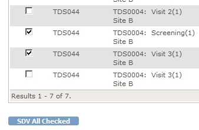
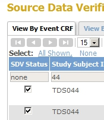

Now you can mark this CRF as SDV'ed by clicking the button labeled "SDV". In the left column under "Alerts and Messages" you will see "The Event CRFs have been source data verified."
You can also tick the checkbox in the left column for each CRF you have SDV'ed and then click the button in the bottom of your screen, labeled SDV All Checked.

It's also possible to SDV all CRFs in two clicks, for example when you've selected all CRFs of a Subject and found them all in order, you can click "Select: All Shown" in the upper left corner of the matrix, followed by clicking SDV All Checked in the bottom of the screen. Be very careful with this method and only use this when you've made a selection, otherwise you will mark all CRFs listed as SDV'd.

If data in a CRF that has been SDV'd are changed, then the SDV-status changes to "not SDV'd" and the Monitor must SDV the CRF again!

# Elements of a CRF

In a CRF the layout of the screen is as follows.

In the top on the left are displayed the name and version of the CRF and on the right the Subject.

On the next line is a link CRF Header Info and when you click it, a section is shown. If you click the link again, the information will be hidden. The information is about the Event (start-date and the names of the Study and the site), the Subject (Sex and Age At Enrollment) and the Discrepancy Notes of this CRF. The totals of Discrepancy Notes are shown per Status. The different Statuses will be discussed in [Notes & Discrepancies](#--refheading--456-2139846958) [Notes & Discrepancies](#--refheading--456-2139846958).
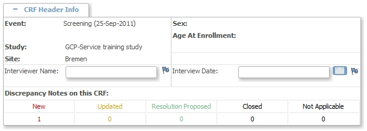

The actual CRF data are displayed in one or more tabs. You can switch to another tab by clicking on it, or by using the select-box on the right. It may look like you are able to modify the data, but it is not possible to save them to the database.

To the right of each input field is a flag. The color of this flag indicates if there is a Discrepancy Note attached to this item and the status of it. You can view, update or add a Discrepancy Note by clicking on the flag. How this is done will be discussed in the following paragraphs.

# Notes & Discrepancies

In OpenClinica four types of Discrepancy Notes exist: "Query", "Failed Validation Check", "Reason for Change" and "Annotation".

The first type, "Query", can only be created by a Monitor. Particularly during the process of Source Data Verification: if data entered in OpenClinica does not match the source data, the monitor can create a Query to ask the person responsible for data-entry, to correct the item. See paragrap [An example of a Query](#--refheading--932-355433200) [An example of a Query](#--refheading--932-355433200).

The second type, "Failed Validation Check", is raised if a value entered exceeds a certain range, or if a Validation check if violated, for example a weight of more than 150 kg. See paragraph [An example of a Failed Validation Check](#--refheading--1892-355433200) [An example of a Failed Validation Check](#--refheading--1892-355433200)

The third type, "Annotation" occurs when someone performing data-entry wants to add a note to an input field. See paragraph [An example of an Annotation](#--refheading--1942-355433200) [An example of an Annotation](#--refheading--1942-355433200)

The fourth type, "Reason for Change" is created automatically when data are changed of a CRF that was already marked as "Complete" See paragraph [An example of a Reason for Change](#--refheading--1944-355433200) [An example of a Reason for Change](#--refheading--1944-355433200).

You can get a list of all Discrepancies by clicking Notes & Discrepancies in the top of your screen or by using the menu option Tasks, Submit Data - Notes & Discrepancy. In the screen that opens all Discrepancies are listed and a summary of this list is given in the top of the screen in the form of a matrix.

A Discrepancy has a Status, which is indicated by the color of the flag: "New" , "Updated", "Resolution Proposed", "Closed" or "Not applicable". What the possible statuses are for the four different types of Discrepancies will be discussed in the next paragraphs.

A CRF-item can have one or more Discrepancies and a Discrepancy has a thread of one or more Notes. Each Discrepancy will have a row in this screen, but if an item has more than one Discrepancy, there will still be just one flag in the CRF.

A Discrepancy Note can not be deleted: only the status can be changed to "Closed".

You can sort the Discrepancies on three columns: "SubjectID", "Days open" and "Days Since Updated"

You can filter the Discrepancies on each of the columns or on a combination of these. For example you can filter on all Discrepancies with status "New and Updated" for Site "B" and sort them on Study Subject ID in descending order.
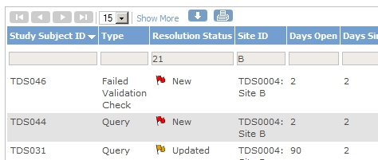

The columns "Days open" and "Days Since Updated" only display data for records with Status "New", "Updated" or "Resolution Proposed". They can be used in combination with the greater-than or less-than signs. For example if you want a list of all Discrepancies that have been updated in the last week, you enter in the inputbox under "Days Since Updated" "<7".

You can download the selection you made by clicking the Down-Arrow-icon: a new screen opens in which you can choose the format, comma-separated-values or pdf.

To view or update a Discrepancy, click one of the two icons in the right column, "View" or "View within record", the magnifier-icon or the right-arrow-icon. If you click "View", a separate window will open with the details of the Discrepancy. If you click "View within record", the CRF is opened in your current browser-window, plus a new window opens with the Discrepancy. Another convenient way to open the CRF plus the Discrepancy is by right-clicking on "View within record" and then choosing "Open link in new window".

In the next four sections we will discuss how each type of Discrepancy is generated, by whom and what statuses this type of Discrepancy can have and what is expected of you as a monitor.

# An example of a Query

Queries are made by Monitors, mostly in the process of Source Data Verification. When you compare the source data and the data in OpenClinica and find a difference, you create a Query. You do this in the CRF you are SDV-ing by clicking the flag to the right of the item that has a difference. A new window opens, "Add Discrepancy Note". Here you must give a short Desciption of what you found, a Detailed Note, that explains in detail what action must be taken. The Type of the Discrepancy is "Query" and can not be changed. The Status however can be chosen: "New", "Updated" or "Closed".

For an example, let's say that the for "Height"  a value was entered of "120", while the Monitor reads "170" in the source data. Click on the flag next to the inputbox of "Height".

In the Discrepancy window that opens you fill in for Description "Wrong value" and in Detailed Note "I read 170. Please correct this." The type of Discrepancy is "Query" and this can not be changed. The field "Set to Status" can be left at "New".You can choose who to assign this Discrepancy to and by default this is the person who entered the data. If you want to send the user an e-mail, tick the box "Email Assigned User". This mail will be automatically generated and can not be edited by you. When you've completed the form, click Submit & Close.

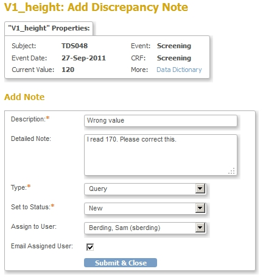

The user will see this Discrepancy in the list "Notes & Discrepancies Assigned to Me". He or she can change the value for Height and after that, update the Discrepancy, indicating the correction and setting the Status of the Discrepancy to "Updated" or to "Resolution Proposed". By default the assigned user is the one who created the Query, so this is left unchanged and again it is possible to send an e-mail.

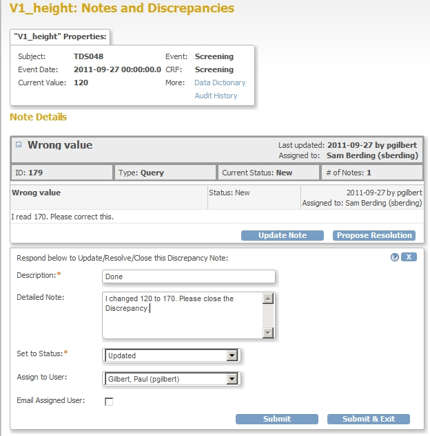

Now after this correction, if the Monitor clicks Home and then Notes & Discrepancies to Me, the Query comes up in the list.

The Monitor opens the CRF by clicking on "View within record" and verify that indeed the value has been changed to "170". He/she switches to the window with the Discrepancy and clicks the button Close Note. In the section that opens he/she fills in for "Description" "Checked". For "Set to Status" he/she chooses "Closed" and for "Assign to User" he/she chooses blank. Finally click Submit & Exit.

From this example we see that the Status of this type of Discrepancy starts with "New", then changes one or more times to "Updated" or "Resolution Proposed" and finally ends with "Closed".

The Monitor-role is the only role that can Close a Discrepancy.

# An example of a Failed Validation Check

A Failed Validation Check is a Discrepancy that's automatically created by OpenClinica. For example on a field where the number of dispensed vials must be entered, an upperrange is defined of 240. If the user enters "250", this results in a message "[No. of dispensed vials must be between 0 and 241]". If this is indeed the number of vials as recorded in the source data, the user must enter this. In order to save the data he must first fill in the details of the Discrepancy.

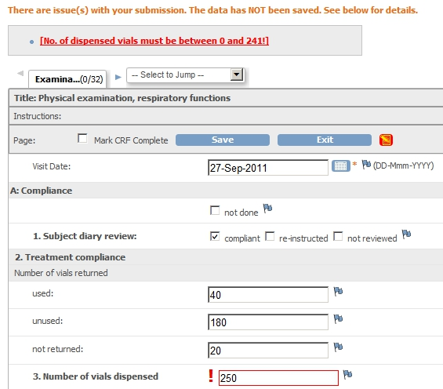

This is done by clicking the blue flag to the right of the field. A new window opens Add Discrepancy Note and in this window the Clinical Research Coordinator or the Investigator gives a short description of the problem in the input field “Description”, for example “Value is correct”. For “Detailed Note” "more vials were dispensed because of holiday.” can be entered. The field “Type” can be left as “Failed Validation Check” and “Set to Status” can be left as “New”. Unlike a Monitor, an Investigator, or a Clinical Research Coordinator, can not assign a Discrepancy to another user. To save the data of the Discrepancy, the button Submit must be clicked.

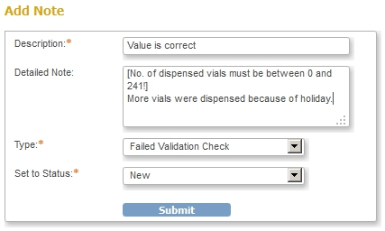

When the Monitor logs in, he/she will check for any new Discrepancies by clicking on the menu-option Notes & Discrepancies and filtering on Status New. The new Discrepancy is in the list and by clicking on the "View within record"-icon we open the CRF and the Discrepancy.

In this case the value is accepted by the Monitor, so he/she clicks  Close Note and for Description enters "Accepted" and leaves Detailed Note blank. For "Set to Status" he/she chooses "Closed". "Assign to User" will again be the user who started the Discrepancy. When this user logs in, the Discrepancy will be in the list of Notes & Discrepancies Assigned to Me, but the status will be closed.

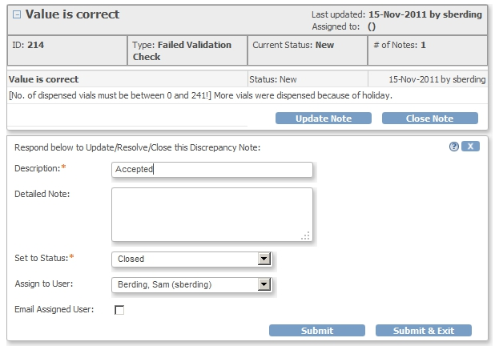

Again we see that the Status of this type of Discrepancy starts with "New", then changes one or more times to "Updated" or "Resolution Proposed" and finally ends with "Closed": just as the Discrepancy-type "Failed Validation Check".

# An example of an Annotation

Annotations are a special kind of Discrepancies because they can only be made by Clinial Research Coordinators and Investigators and there is no follow-up to them. For example, an Investigator notes that the Subject says 2 visits to an ER have been made in one week.

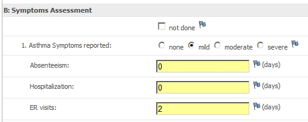

He or she finds may want to explain that the details of these visits were recorded in the Adverse Event CRF and makes a note for the Monitor, by clicking the flag to the right if the field. In the screen Add Discrepancy Note he enters for Description “2 ER Visits” and for Detailed Note “Details of these visits are on the AE-CRF dated 21-Oct-2011 and 23-Oct-2011”. Type is left as “Annotation” and “Set to Status” can only be “Not Applicable”.

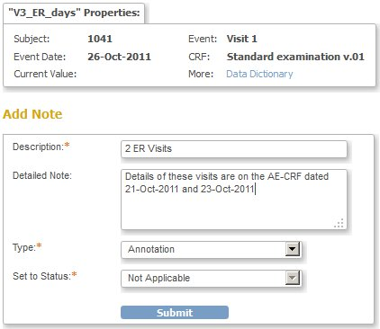

When the Monitor reviews the CRF, it is visible that a note was attached to this field, because it has a white flag, indicating an Annotation. If the Monitor clicks on the white flag, it is not possible to add a Note to the Annotation. But if the button Begin New Thread is clicked a new Discreppancy is created of type Query. This can be followed in the same way as described in [An example of a Query](#--refheading--932-355433200) [An example of a Query](#--refheading--932-355433200).

So the status of a Discrepancy of type Annotation is always "Not Applicable".

The only exception to this is when data are deleted: then all Discrepancies of all types will get the status "Closed".

# An example of a Reason for Change

After a CRF has been marked complete, all changes to the data have to be accounted for. This means that a reason for change must be given. Therefor a Discrepancy is automatically created when a user changes data in a CRF that is marked complete.
When this happens, an error-message appears "You have changed data after this CRF was marked complete. You must provide a Reason For Change discrepancy note for this item before you can save this updated information." and the flag next to the changed item must be clicked.

When the Monitor opens this Discrepancy, not only is the normal information available, but also the Audit History. Here both the old and the new value are shown.
As with an Annotation, the status of a Discrepancy of type "Reason for Change" is always "Not Applicable", except when data are deleted: then the status changes to "Closed".

The Monitor will see the Discrepancy in the CRF at the time of Source Data Verification. If the CRF was already marked as SDV'd, the status will change to Not-SDV'd, when the data of the CRF are changed. The Monitor will must do the Source Data Verification again for this CRF and will then see the Discrepancy in the CRF, indicated by the white flag.

# Study Audit Log

In the Study Audit Log all changes are recorded. This is displayed on a per-Subject-basis. The Study Audit Log can be accessed by clicking Tasks, Monitor and Manage Data – Study Audit Log. A screen is opened with a list of all available Subjects. You can apply filters to quickly find a Subject.

View the Audit Log of a Subject by clicking the magnifier-icon to the right.

Audit data apply to the Subject, the Events, the CRFs and the CRF-items.

It is not possible to filter on these.
